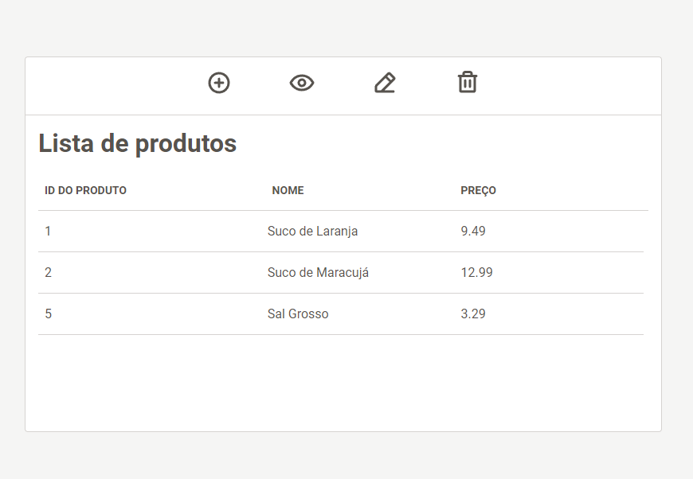
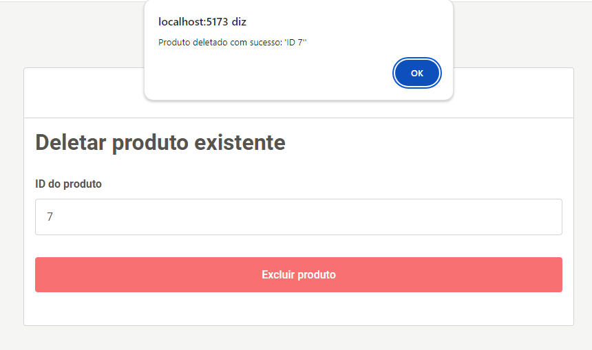

<h1 align="center">CRUD APP 2 🗂️</h1>

<div align="center">

[](https://img.shields.io/badge/PostgreSQL-316192?style=for-the-badge&logo=postgresql&logoColor=white)
[](https://img.shields.io/badge/PHP-777BB4?style=for-the-badge&logo=php&logoColor=white)
[](https://img.shields.io/badge/Laravel-FF2D20?style=for-the-badge&logo=laravel&logoColor=white)
[](https://img.shields.io/badge/Vue.js-35495E?style=for-the-badge&logo=vue.js&logoColor=4FC08D)
</div>

<p align="center">
  <b>Second repository of the project <a href="https://github.com/only-crud-organization">
  Only Crud
  </a>, where I develop the same project with different stacks to evaluate and compare their performance, as well as the positives and negatives of their usage.
  </b>
</p>
<p align="center">
    <b>
    The entire process has been documented live, and the result will be posted later on my social media! Connect with me on <a href="https://www.linkedin.com/in/gabrielfneves/">LinkedIn</a> to find out the final outcome!
    </b>
</p>

<h2>Media</h2>
<div align="center">


</br>


</br>


</br>


</br>


</br>

</br>
</div>
<h2>Stack</h2>

<h4>CRUD 2:</h4>

* PostgresSQL
* PHP
* Laravel
* Blade
* Vue.js


<h2>Project Requirements</h2>

<h4>How the 'only crud' project works</h4>

*"Using the defined stack, create a product CRUD respecting the following rules"*

**Each product must have:**

* Identification code
* Name
* Price

**In the application, the user should be able to:**

* Add a new product
* Edit an existing product
* Delete an existing product
* View all registered products in a table or list

**Not allowed:**

* Repeating technologies used in the previous stack (except HTML, CSS, and JS)
* Using any kind of code generated by AI and the like

**Allowed:**

* Consulting the documentation of the technology you are using
* Consulting forums, as long as you don't copy code directly without understanding what it does

**The entire development process must be documented:**
* The entire development process must be recorded live
* The application must be made live

<h2>Project Setup</h2>
<h3>⚠️ Prerequisites</h3>

To run the application, make sure you have the following installed:

* PHP 8.2.12
* Composer 2.6.6
* Npm 10.2.3

<h3>Server</h3>

Clone this repository and navigate to the '/server' folder:

```bash
git clone https://github.com/only-crud-organization/crud-2.git
```

```bash
    cd server
```

After cloning the repository, install dependencies using Composer:
```bash
    composer install
```

Before starting the project, make sure to configure your environment: Copy the `.env.example` file to `.env` and adjust the settings, including the database credentials (in my case, I configured it for postgres, but you can use any database you prefer)

```env
    DB_CONNECTION=YOUR_DB
    DB_HOST=YOUR_HOST
    DB_PORT=YOUR_PORT
    DB_DATABASE=YOUR_DB
    DB_USERNAME=YOUR_USERNAME
    DB_PASSWORD=YOUR_DB_PASSWORD

```

Then, run the migrations to create tables in the database, using:

```bash
    php artisan migrate
```

Next, to test the backend of the application or start the server, use:

```bash
    php artisan serve
```

<h3>Client</h3>
Navigate to the '/client' folder:

```bash
    cd client
```

Install dependencies using `npm` or `yarn`:
```bash
    npm i
```

<h2>How to Run</h1>

Finally, **after starting the server**, test the application with the command line:

```bash
    npm run dev
```

