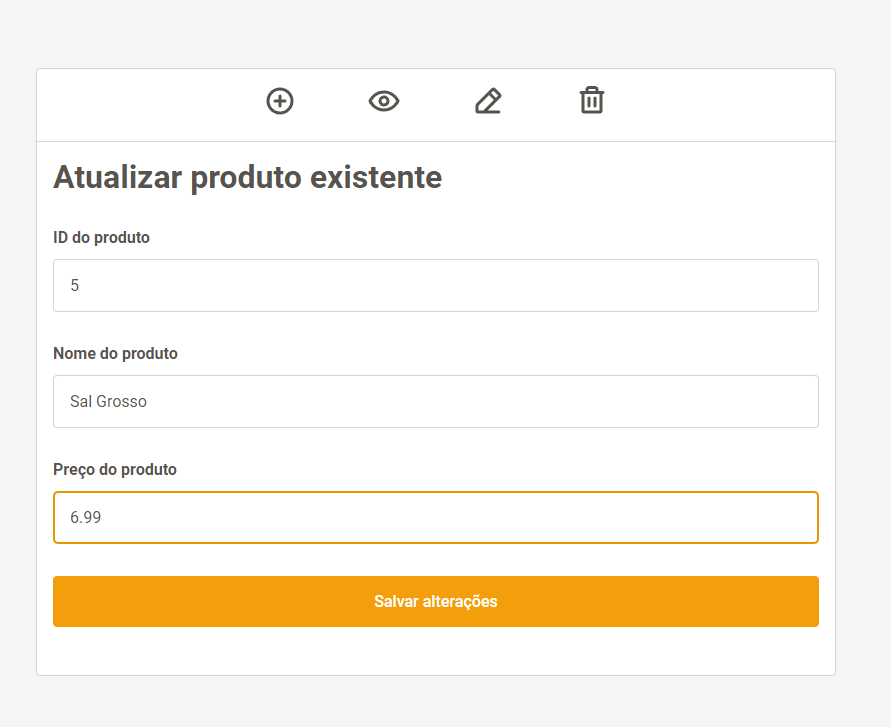
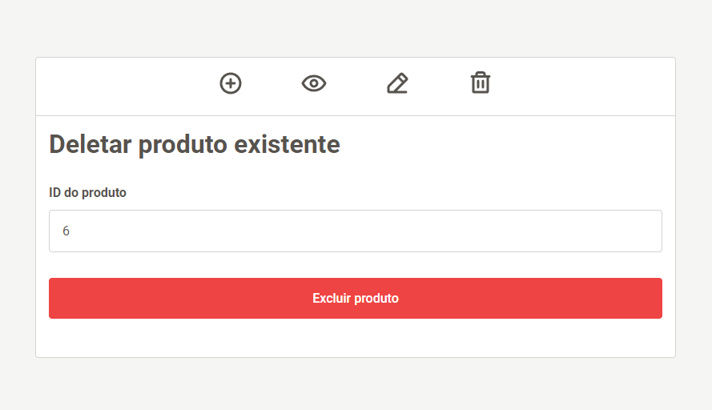

<h1 align="center">CRUD APP 2 🗂️</h1>

<div align="center" id="resume">

[](https://img.shields.io/badge/PostgreSQL-316192?style=for-the-badge&logo=postgresql&logoColor=white)
[](https://img.shields.io/badge/PHP-777BB4?style=for-the-badge&logo=php&logoColor=white)
[](https://img.shields.io/badge/Laravel-FF2D20?style=for-the-badge&logo=laravel&logoColor=white)
[](https://img.shields.io/badge/Vue.js-35495E?style=for-the-badge&logo=vue.js&logoColor=4FC08D)
</div>

<div align="center">
    <a href="https://github.com/only-crud-organization/crud-2">PT-BR</a> ●
    <a href="#summary">EN</a> 
</div>

<br/>

<div align="center">
    <a href="#summary">Summary</a> ●
    <a href="#stack">Used Technologies</a> ●
    <a href="#project-reqs">Project Requirements</a> ●
    <a href="#project-setup">How to Test</a> 
</div>

<br/>

<h2 align="center" id="summary">Summary</h2>
<p align="center">
  <b>Second repository of the project <a href="https://github.com/only-crud-organization">
  Only Crud
  </a>, where I develop the same project with different stacks to evaluate and compare the performance of each, as well as the positives and negatives of their use.
  </b>
</p>

<p align="center">
  The entire process was documented live, and the result will be posted later on my social media!
  Connect with me on <b> <a href="https://www.linkedin.com/in/gabrielfneves/">LinkedIn</a></b> to find out the final result!
</p>


<p></p>

<div align="center">


<p></p>
    


<p></p>



<p></p>



<p></p>


<p></p>


<p></p>
</div>

<h2 id="stack">📚 Stack</h2>

<h4>CRUD 2:</h4>

* PostgresSQL
* PHP
* Laravel
* Blade
* Vue.js

<h2 id="project-reqs">📌 Project Requirements</h2>

<h4>How the 'only crud' project works</h4>

*"Using the defined stack, create a CRUD for products respecting the following rules"*

**Each product must have:**

* Identification code
* Name
* Price

**In the application, the user should be able to:**

* Register a new product
* Edit an existing product
* Delete an existing product
* View all registered products in a table or list

**Not allowed:**

* Repeating technologies used in the previous stack (except HTML, CSS, and JS)
* Using any kind of code generated by AI and similar technologies

**Allowed:**

* Referencing the documentation of the technology you are using
* Consulting forums, as long as you do not directly copy code without understanding what it does

**The entire development process must be documented:**
* The entire development process must be recorded live
* The application must be developed live

<h2 id="project-setup">🚀 Project Setup</h2>
<h3>⚠️ Prerequisites</h3>

To run the application, make sure you have installed:

* PHP 8.2.12
* Composer 2.6.6
* Npm 10.2.3

<h3>Server</h3>

Clone this repository and navigate to the '/server' folder:
```bash
    git clone https://github.com/only-crud-organization/crud-2.git
```

```bash
  cd server
```

After cloning the repository, install the dependencies using Composer:

```bash
  composer install

```
Before starting the project, make sure to set up your environment: Copy the .env.example file to .env and adjust the settings, including the database credentials (in my case, I configured it for PostgreSQL, but you can use any database you prefer).
```env
    DB_CONNECTION=YOUR_DB
    DB_HOST=YOUR_HOST
    DB_PORT=YOUR_PORT
    DB_DATABASE=YOUR_DB
    DB_USERNAME=YOUR_USERNAME
    DB_PASSWORD=YOUR_DB_PASSWORD
```

Then, run the migrations to create the tables in the database, using:

```bash
    php artisan migrate
```

Next, to test the backend of the application or start the server, use:

```bash
    php artisan serve
```

<h3>Client</h3>

Navigate to the '/client' folder:

```node
    cd client
```
Install the dependencies using `npm` or `yarn`:
```node
    npm i
```
<h2>How to Test</h1>

Finally, after starting the server, test the application with the command:
```node
  npm run dev
```

    

