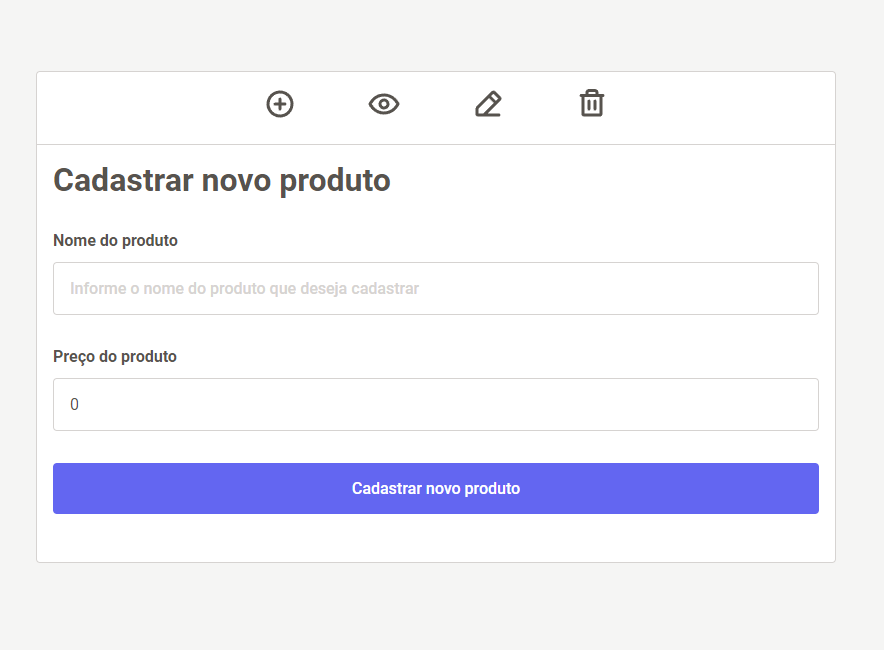
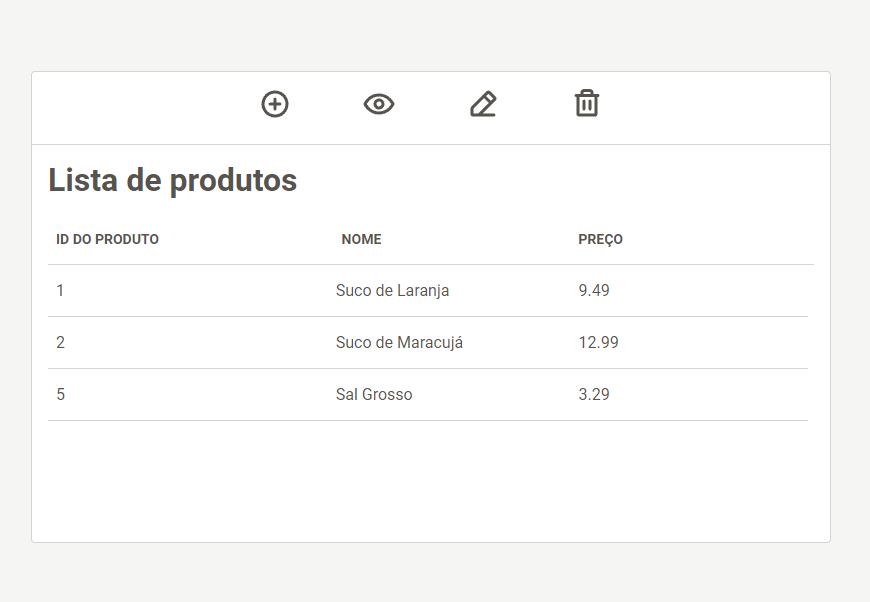
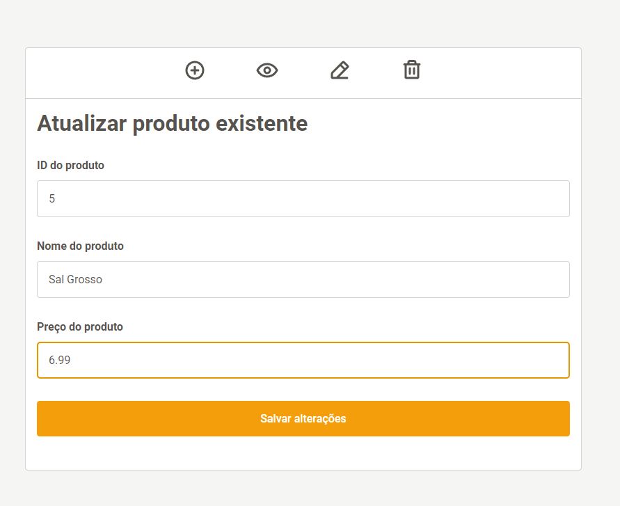
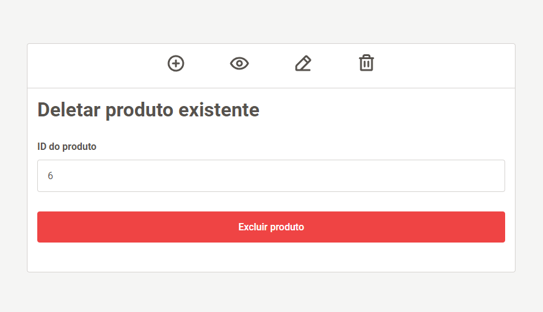
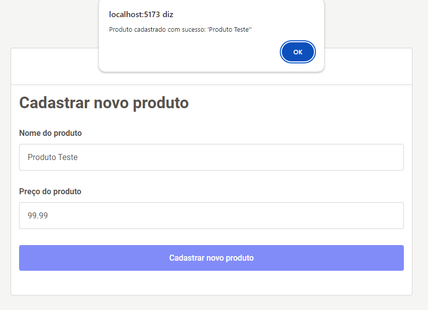
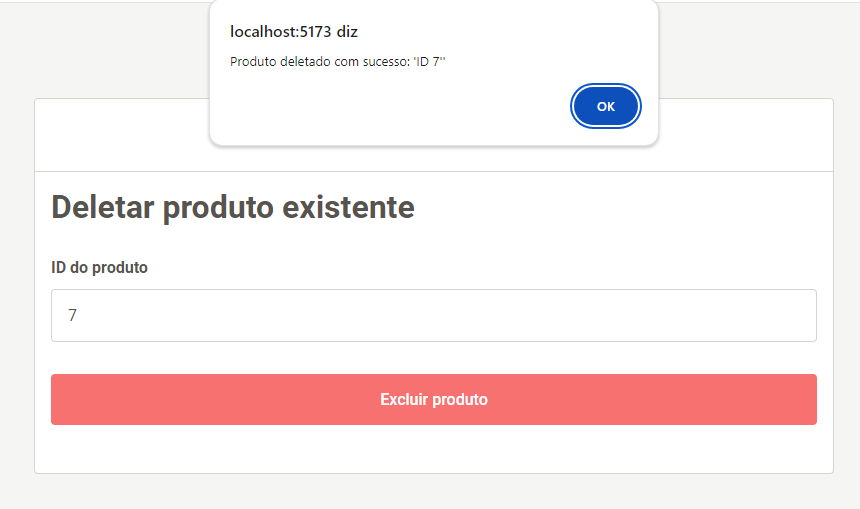

<h1 align="center">CRUD APP 2 🗂️</h1>


<div align="center" id="resume>

[](https://img.shields.io/badge/PostgreSQL-316192?style=for-the-badge&logo=postgresql&logoColor=white)
[](https://img.shields.io/badge/PHP-777BB4?style=for-the-badge&logo=php&logoColor=white)
[](https://img.shields.io/badge/Laravel-FF2D20?style=for-the-badge&logo=laravel&logoColor=white)
[](https://img.shields.io/badge/Vue.js-35495E?style=for-the-badge&logo=vue.js&logoColor=4FC08D)
</div>

<div align="center">
    <a href="#resume">Resumo</a> ●
    <a href="#stack">Tecnologias usadas</a> ●
    <a href="#project-reqs">Requisitos do projeto</a> ●
     <a href="#project-setup">Como testar</a> 
</div>
<br/>

<p align="center">
  <b>Segundo repositório do projeto <a href="https://github.com/only-crud-organization">
  Only Crud
  </a>, onde desenvolvo o mesmo projeto com stacks diferentes para avaliar e comparar o desempenho de cada uma, assim como os pontos positivos e negativos do seu uso. 
  </b>
</p>
<p align="center">

<p align="center">
    <b>
    O processo todo foi documentado em live, e o resultado será postado posteriormente em minhas redes sociais! Conecte-se comigo no <a href="https://www.linkedin.com/in/gabrielfneves/">Linkedin</a> para saber o resultado final!
    </b>
</p>

<div  align="center">


</br>


</br>


</br>


</br>


</br>

</br>
</div>
<h2 id="stack">Stack</h2>

<h4>CRUD 2:</h4>

* PostgresSQL
* PHP
* Laravel
* Blade
* Vue.js


<h2 id="project-reqs">Requisitos de projeto</h2>

<h4>Como funciona o projeto 'only crud'</h4>

*"Usando a stack definida, crie um CRUD de produtos respeitando as seguintes regras"*

**Cada produto dever possuir:**

* Código de identificação
* Nome
* Preço

**Na aplicação, o usuário deve ser capaz de:**

* Cadastrar um novo produto
* Editar um produto existente
* Excluir um produto existente
* Ver todos os produtos cadastrados em uma tabela ou lista

**Não é permitido:**

* Repetir tecnologias usadas na stack anterior (exceto HTML, CSS e JS)
* Usar nenhum tipo de código gerado por IA e afins

**É permitido:**

* Consultar a documentação da tecnologia que está usando
* Consultar fórums, desde que não copie diretamente um código
sem entender do que trata

**Todo processo de desenvolvimento deverá ser documentado**
* Todo o processo de desenvolvimento deve ser gravado em live
* A aplicação deve ser feita ao vivo

<h2 id="project-setup">Setup do Projeto</h2>
<h3>⚠️ Pré-requisitos</h3>

Para rodar a aplicação, certifique-se de ter instalado:

* PHP 8.2.12
* Composer 2.6.6
* Npm 10.2.3

<h3>Servidor</h3>

Clone este repositório e navegue até a pasta '/server':

```bash
    git clone https://github.com/only-crud-organization/crud-2.git
```
```bash
    cd server
```

Após clonar o repositório, instale as dependências usando o Composer:
```bash
    composer install
```

Antes de iniciar o projeto, certifique-se de configurar seu ambiente: Copie o arquivo `.env.example` para `.env` e ajuste as configurações, incluindo as credenciais do banco de dados (no meu caso, eu o configurei para postgres, mas você pode usar qualquer banco de dados que preferir).

```env
    DB_CONNECTION=SEU_BANCO
    DB_HOST=SEU_HOST
    DB_PORT=SUA_PORTA
    DB_DATABASE=SEU_DB
    DB_USERNAME=SEU_USERNAME
    DB_PASSWORD=SEU_DB_PASSWORD
```

Em seguida, faça as *migrations* para criar as tabelas no banco de dados, usando:

```bash
    php artisan migrate
```

Então, para testar o backend da aplicação ou ligar o servidor, utilize:

```bash
    php artisan serve
```

<h3>Cliente</h3>

Navegue até a pasta '/client':
```bash
    cd client
```

Instale as dependências utilizando ```npm``` ou ```yarn```:
```bash
    npm i
```

<h2>Como rodar</h1>

Por fim, após ligar o servidor, teste a aplicação com o comando:
```bash
    npm run dev
```


